# Django Blog Application

A full-featured Blog Application built using Django, Python, HTML, and CSS.

This project started as a Django blog covering models, forms, templates, CRUD operations, and user authentication, and was later extended with model relationships, nested comments, likes, ratings, ORM aggregation, and query optimization.

## Project Overview

The Django Blog Application allows users to register an account, log in, create blog posts, comment on posts (including nested replies), like posts and comments, rate posts, and view engagement statistics across the site.

Every post, comment, like, and rating is connected to the user who created it, with proper ownership restrictions throughout.

## Features

### Core Blog

- User registration, login, and logout
- Authentication-protected pages
- Create, view, edit, and delete blog posts
- Post ownership protection (only the author can edit/delete their own post)
- "My Posts" page
- Optional image upload for blog posts
- Search posts by title, content, or author
- Filter posts by category
- Success and error messages
- Django Admin panel
- SQLite database
- Template inheritance and custom CSS styling

### Comments & Replies

- Authenticated users can comment on any post
- Users can edit or delete their own comments only
- Unlimited nested replies (a self-referencing relationship on the Comment model)
- Reply forms open per-comment using a pure CSS toggle (no JavaScript)

### Likes & Ratings

- Like/unlike a post, with a live like count
- Like/unlike a comment, with a live like count
- Duplicate likes are prevented at the database level
- 1–5 star rating system for posts
- Users can update their existing rating
- Average rating and total rating count shown per post

### Statistics & Discovery

- Popular Posts page, ranked by likes, comments, and average rating
- Profile page for every user showing posts written, comments made, likes given, ratings given, total likes received, and first/most recent post dates
- Advanced Queries page demonstrating ORM lookups (filter by author, keyword search, minimum likes, minimum rating, comment count, and related-object filtering)

## Technologies Used

- Python
- Django
- HTML
- CSS
- SQLite
- Pillow

## Django Concepts Practiced

- Django project and app structure
- Models and model relationships (ForeignKey, self-referencing ForeignKey)
- Views, URLs, and templates
- Template inheritance and recursive template includes
- Django Forms and ModelForms
- Django ORM: `filter()`, `Q` objects, and field lookups (`icontains`, `gte`, `gt`)
- Aggregation and annotation (`Count`, `Avg`, `Sum`, `Min`, `Max`)
- Query optimization with `select_related()` and `prefetch_related()`
- Related-object lookups across multiple models
- User authentication, registration, login, and logout
- CRUD operations
- Django Messages framework
- Static and media files
- Django Admin customization

## Models

### BlogPost

- Title
- Content
- Category
- Author (linked to Django's built-in User model)
- Optional image
- Created and updated timestamps

### Comment

- Post (the post it belongs to)
- Author
- Parent (self-referencing — `null` for a top-level comment, set to another comment for a reply)
- Content
- Created and updated timestamps

### PostLike / CommentLike

- Links a user to a post or comment
- One like per user per post/comment, enforced with a database-level unique constraint

### PostRating

- Links a user to a post with a rating from 1 to 5
- One rating per user per post; re-rating updates the existing rating

## Authentication

The application uses Django's built-in authentication system.

Users can:

1. Register an account
2. Log in
3. Create, edit, and delete their own blog posts
4. Comment on posts and reply to other comments
5. Like posts and comments
6. Rate posts
7. View their own and others' profile statistics
8. Log out

Only authenticated users can access protected pages such as Create Post, My Posts, Profile, commenting, liking, and rating.

## Post & Comment Ownership

Every post and comment is connected to the user who created it. Users can only edit or delete content they own — one user cannot modify or delete another user's posts or comments.

## Query Optimization

- `select_related()` is used wherever a post's author is displayed, avoiding a separate query per post.
- `prefetch_related()` is used where the actual related objects (not just a count) are needed — for example, showing recent commenters on the My Posts page.
- Engagement counts (likes, comments, ratings) are computed with `annotate()` directly in the database instead of counting in Python.

## Django Admin

The Django Admin panel can be used to manage every model in the app: blog posts, comments, post likes, comment likes, and ratings. The BlogPost admin list view also shows live comment count, like count, and average rating per post.

# Screenshots

## Home Page

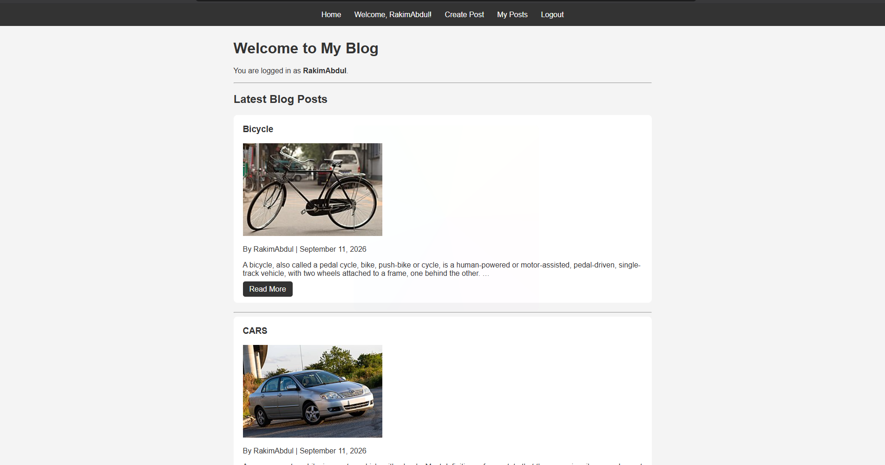

## Registration Page

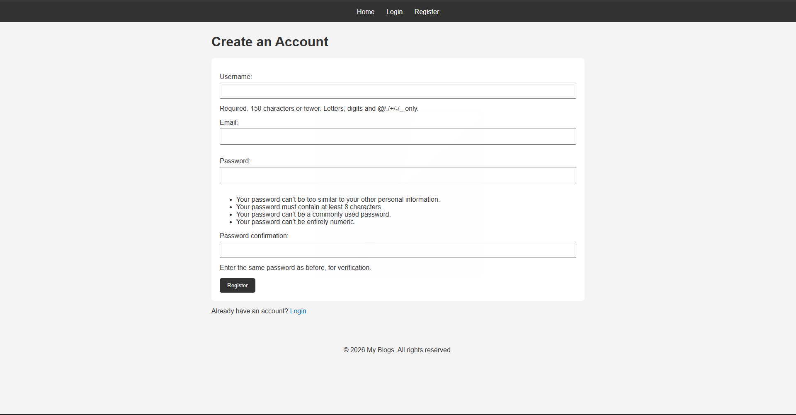

## Login Page

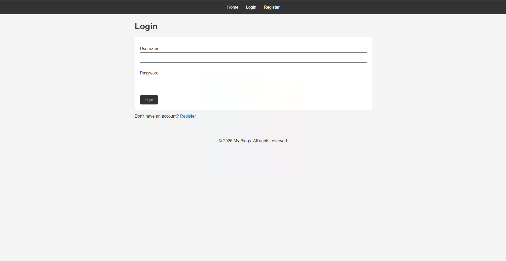

## Create Post Page

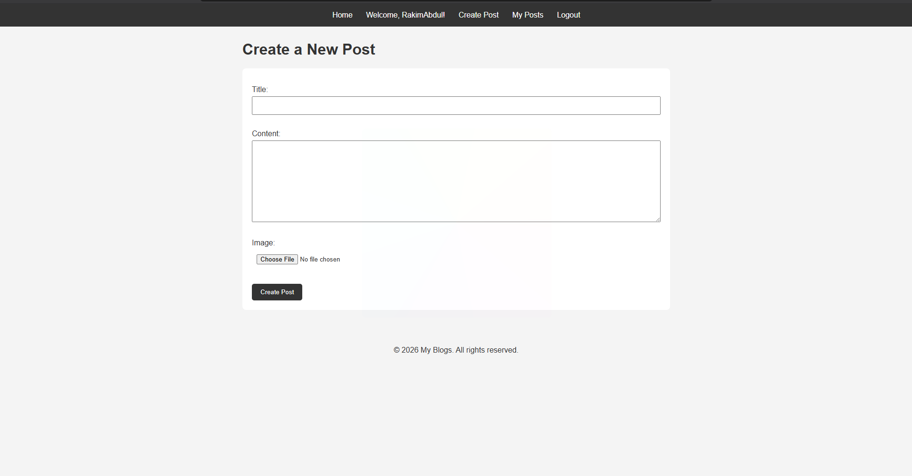

## Post Details, Comments & Replies

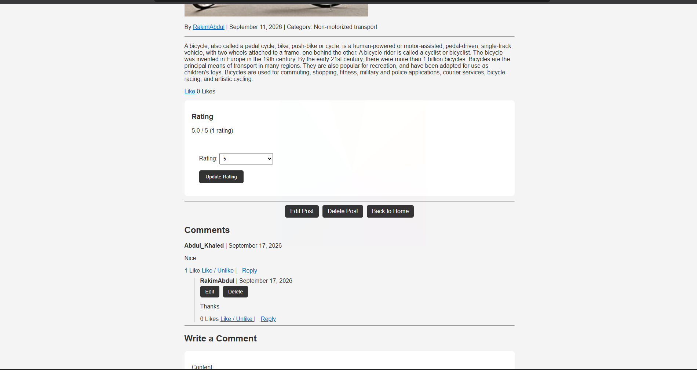

## Edit Post Page

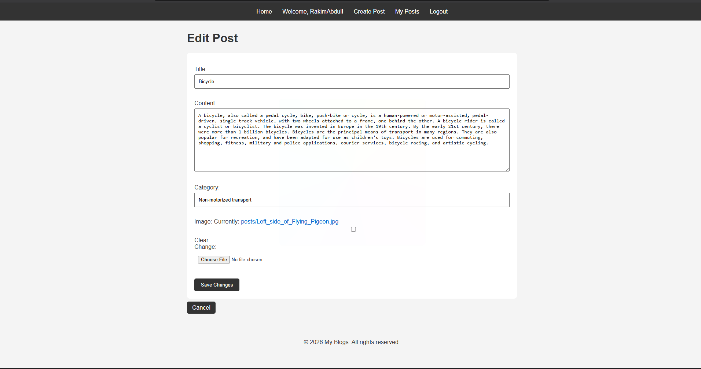

## Delete Confirmation Page

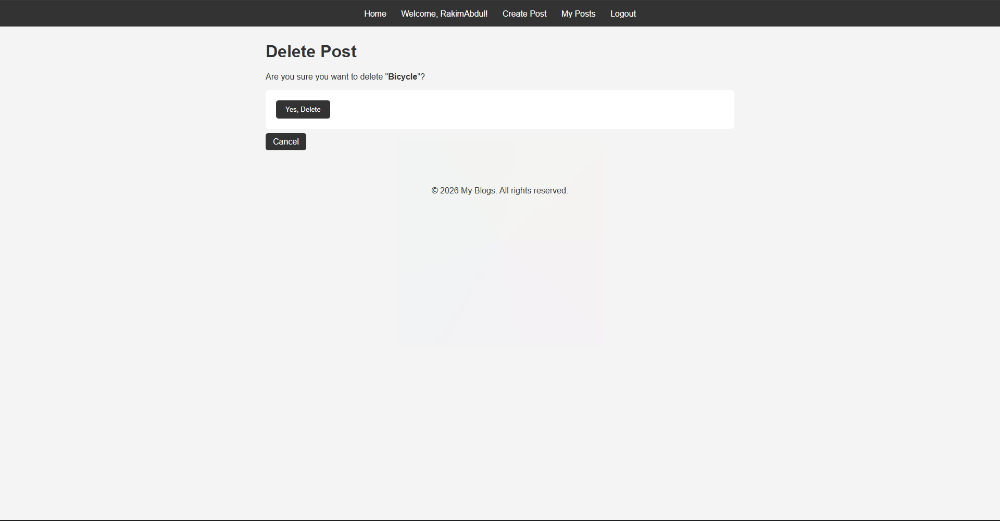

## My Posts Page

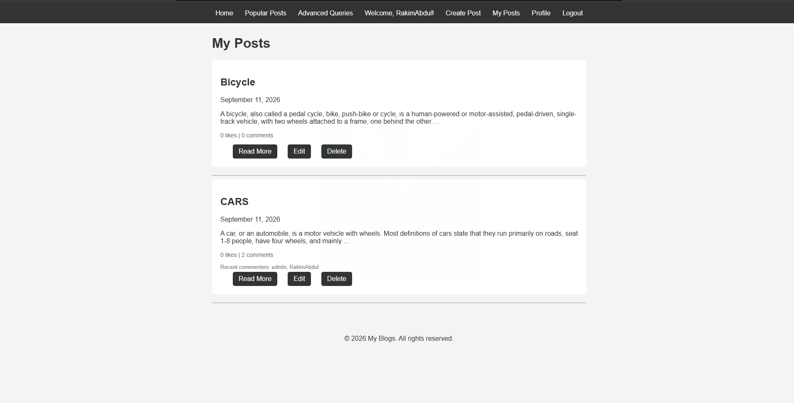

## Profile Page

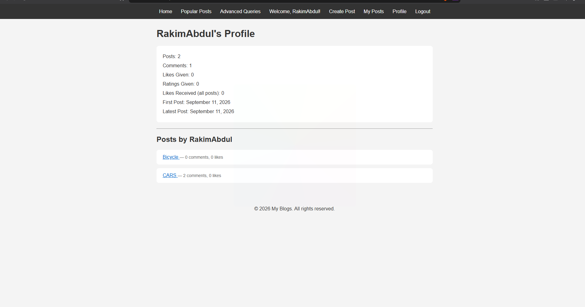

## Popular Posts Page

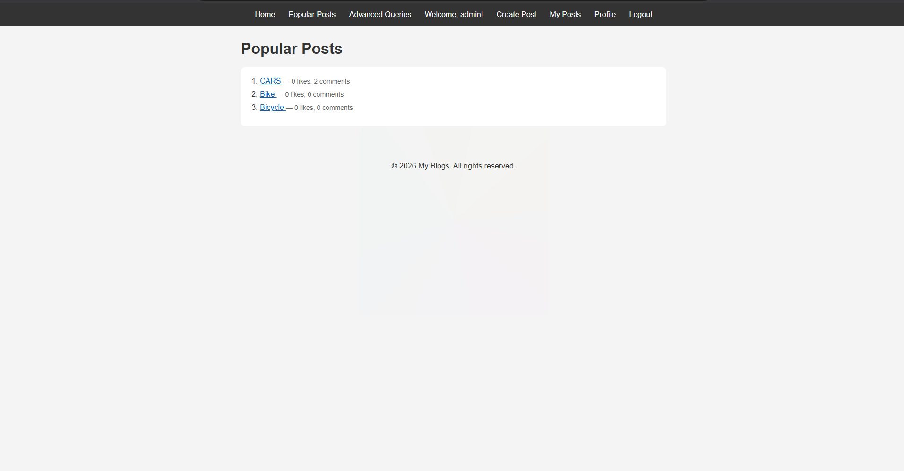

## Advanced ORM Queries Page

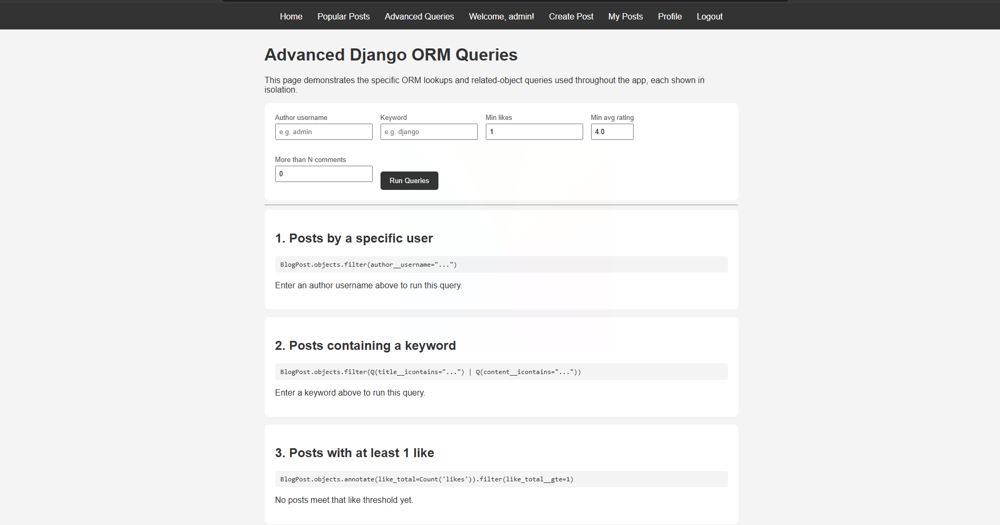

## Django Admin Panel

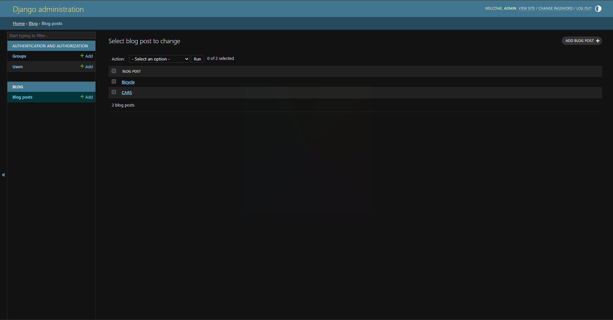

# How to Run the Project

Follow these steps to run the Django Blog Application on your computer.

## Clone the Repository

Clone the project from GitHub:

```bash
git clone https://github.com/adam-61/Django-Blog-Application
```

## Set Up and Run

```bash
cd Django-Blog-Application
python -m venv venv
venv\Scripts\activate
pip install -r requirements.txt
cd blog_project
python manage.py migrate
python manage.py createsuperuser
python manage.py runserver
```

Then visit:

- http://127.0.0.1:8000/
- http://127.0.0.1:8000/admin/
